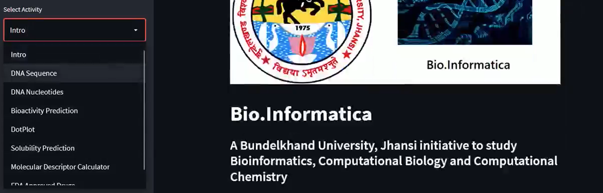

# Bio.Informatica

# A Common Platform for the study related to Bioinformatics, Computational Biology and Computational Chemistry.
# Activities
* Intro
* DNA Sequence
* DNA Nucleotides
* Bioactivity Predictions
* DotPlot
* Solubility Prediction
* Molecular Descriptor Calculator
* FDA Approved Drugs
# Methods to run the project
* Terminal
* Docker Hub
# Terminal
# Install Python and Java into your System.
* Open terminal in the folder where you have pull the project.
* Run "pip install -r requirements.txt" in root folder
* Type: "streamlit run Bio.Informatica.py"
# Docker Hub
* Install Docker in the System
* Install Docker Hub in the System
* [Docker Image Link](https://hub.docker.com/r/piyushmishradocker/bio.informatica)
* In the terminal type : "docker pull piyushmishradocker/bio.informatica"

# Screenshots of the Project

  
   
  

# Useful Links

**[National Library for Medicine By National Centre for Biotechnology Information](https://www.ncbi.nlm.nih.gov/genome/)**

**[SWISS-PROT - Database Commons](https://ngdc.cncb.ac.cn/databasecommons/database/id/5614)**

**[GenBank](https://www.ncbi.nlm.nih.gov/genbank/)**

**[Open Bioinformatics Journal](https://openbioinformaticsjournal.com/)**

