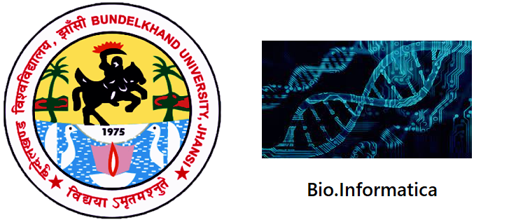

# Bio.Informatica

# A Common Platform for the study related to Bioinformatics, Computational Biology and Computational Chemistry.
# Activities
* Intro
* DNA Sequence
* DNA Nucleotides
* Bioactivity Predictions
* DotPlot
* Solubility Prediction
* Molecular Descriptor Calculator
* FDA Approved Drugs
